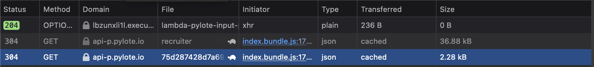

# Documentation de l'Application Sylote

## Introduction

Sylote est une application conçue pour simplifier la recherche et la mise à jour des missions de manière totalement automatisée. Pour fonctionner correctement, l'application nécessite certains paramètres, notamment des mots-clés de recherche, l'ID du pylote, un webhook Discord, et une indication de disponibilité sous forme d'un booléen. Si le pylote ne souhaite pas être disponible, une date au format AAAA-MM-JJ doit être fournie.

## Fonctionnement

1. **Mots-clés de Recherche**
   - L'utilisateur doit spécifier des mots-clés pertinents pour la recherche de missions. Ces mots-clés seront utilisés par Sylote pour filtrer les résultats. Les mots-clés doivent être séparés par des virgules, sans espace entre eux.

2. **ID de Pylote**
   - L'ID du pylote est une identification unique associée à chaque utilisateur. Pour obtenir cet ID, l'utilisateur doit suivre un processus spécifique, qui sera expliqué dans une section dédiée.

3. **Webhook Discord**
   - Un webhook Discord est nécessaire pour que Sylote puisse envoyer des notifications et des mises à jour à l'utilisateur. L'utilisateur doit fournir le lien du webhook correspondant à son serveur Discord.

4. **Disponibilité**
   - L'utilisateur peut indiquer s'il souhaite être disponible ou non pour des missions. Cette information est spécifiée à l'aide d'un booléen. Si l'utilisateur n'est pas disponible, il doit également fournir une date au format AAAA-MM-JJ pour indiquer quand il sera à nouveau disponible.

## Obtention de l'ID de Pylote

Pour obtenir l'ID de pylote, suivez ces étapes :

1. Connectez-vous à votre compte Pylote.
2. Inspectez la page, et allez sur l'onglet "Network"
3. Faites un reload
4. la 3ème requête devrait être celle qui GET votre profil, depuis l'url https://api-p.pylote.io/freelance/profile/VOTRE_ID

## Commandes disponibles 

- install
    - Permet de set Sylote en tant que service, et de rentrer les informations. Sur MacOS il sera probablement nécessaire de désactiver et réactiver le service depuis les Paramètres -> Autoriser en arrière plan

- uninstall
    - L'app a une épine dans le pied

- update 
    - Permet de mettre à jour vos informations, prendra effet au prochain redémarrage

- start
    - Cmd de débug pour l'automation

